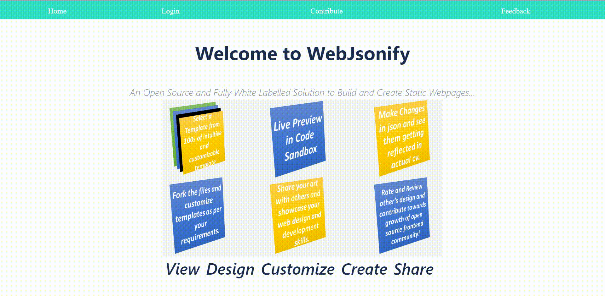
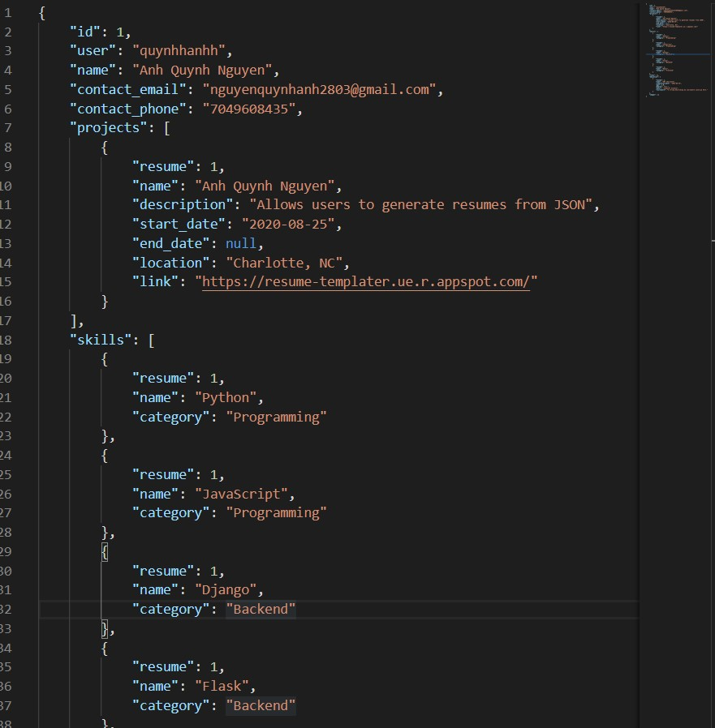
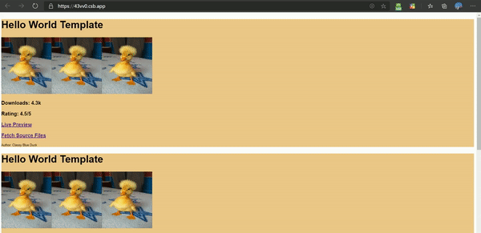
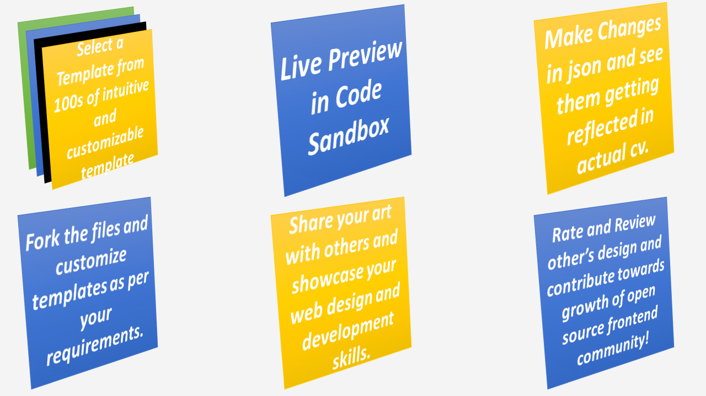

# Web Jsonify

**An open source and fully white-labelled platform to view, design, customize and create static websites.**

## What is Web Jsonify?

**Web Jsonify** is an attempt to create open source *Frontend Development Repository* that enables developers and designers to create amazing front-end designs that are available in different frameworks **(like React/ Angular/ Vu)**.

Here the designers can pick up a template and structurize their json data which acts as a parser to build their frontend website. Currently we have focussed on creating the cv based websites, but the functionality can be expanded further to many other types of templates (like *e-commerce, blogging, data dashboards, etc.*)

Moreover the developers have access to entire source code and can customize the templates to beautify them and make them even more charming and then share their templates to showcase to their dev skills and contribute to frontend open source community.

## What do we Aim For ?

After browsing through multiple *web-dev* websites, we came up with the idea of building an open source easy and reliable solution that could help freshers, job seekers and web developers to showcase their frontend development skills, by using this platform to use, create, beautify, share, showcase and contribute to frontend developers community.

## Upcoming and Planned Features for Web Jsonify

- Open Source Web Templates (CV/ Blogging/ Data Dashboards/ etc.)
- Full Developer Level Access
- Easy Json to CV Website Converter for Non-Developers
- Stars, Ratings and many other User Download Supports.
- No Watermarking or Labelling.
- Angular, Vu and other popular frontend framework support.
- Drag and Design for Non-Developers
- Advanced Animation

## Tools And FrameWorks Used
- Django
- React JS

## Contributors:
- [Cony](https://github.com/nicolas-racchi)
- [anhnguyen](https://github.com/quynhanh-ngx)
- [spidey](https://github.com/sedhha)

    Note that current made cvs can be found [here](src/templates/).